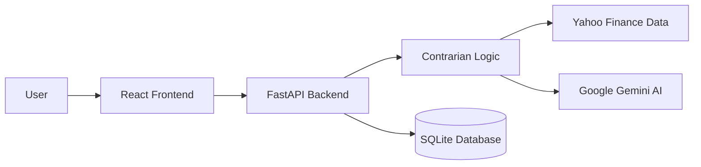

# 📉 Contrarian Stocks: Antigravity 🚀

> **"Be fearful when others are greedy, and greedy when others are fearful."** — Warren Buffett


## 🧐 What is this?

**Contrarian Stocks Antigravity** is an intelligent stock screener designed to find the diamonds in the rough. It scans the S&P 500 for high-quality companies that are currently "unloved" by the market (oversold, beaten down) and uses **AI (Google Gemini)** to generate an instant investment thesis.

Stop catching falling knives. Start catching bottom bounces with data.

---

## ✨ Key Features

### 1. The "Unloved" Filter 💔
We don't just look for cheap stocks; we look for **technically dislocation**:
*   **RSI (Relative Strength Index)**: Identifies oversold conditions (< 40).
*   **Drawdown Detection**: Finds stocks trading >15% below their 52-week highs.
*   **Advanced Technicals**:
    *   **MACD**: Bullish/Bearish crossovers.
    *   **Bollinger Bands**: Price divergence.
    *   **Golden/Death Crosses**: SMA50 vs SMA200 trend analysis.

### 2. The "Quality" Guardrails 🛡️
We filter out the garbage. A stock must have solid fundamentals to make the list:
*   **Forward P/E**: Reasonable valuation (0 < PE < 25).
*   **Profit Margins**: Must be profitable (> 0%).
*   **Sector**: Context-aware analysis.

### 3. AI-Powered Rationale 🧠
The killer feature. Once a stock passes the screens, we send the data to **Google Gemini 3 Pro**.
It analyzes the metrics and writes a **human-readable rationale**:
> *"ABT is trading at 17x earnings despite 15% margins. This is a 21% discount to its historical average, likely due to short-term fears about..."*

### 4. Persistence & Favorites ⭐
*   Built-in **SQLite** database.
*   **Star** your favorite picks to track them over time.
*   REST API backend for full CRUD operations.

---

## 🛠️ Architecture

A modern, containerized full-stack application.



*   **Backend**: Python, FastAPI, SQLAlchemy, Pandas, Ta-Lib (logic).
*   **Frontend**: React, Vite, TailwindCSS (via plain CSS/PostCSS).
*   **Database**: SQLite (local file persistence).
*   **AI**: Google Generative AI (`gemini-3-pro-preview`).

---

## 🚀 Quick Start

### Prerequisites
1.  **Get a Google Gemini API Key**: [Get it here](https://aistudio.google.com/app/apikey).
2.  **Docker** (Recommended) OR **Python 3.10+ & Node.js**.

### Setup Secrets
Create a `.env` file in the root directory:
```bash
cp .env.example .env
```
Edit `.env` and paste your key:
```ini
GEMINI_API_KEY=AIzaSyYourKeyHere...
```

### Option A: 🐳 Docker (Easiest)
Run the entire stack in one container.
```bash
./run_docker.sh
```
*   **Frontend**: http://localhost:8080
*   **API**: http://localhost:8080/docs

### Option B: ⚡ Local Development
Run backend and frontend separately for development.
```bash
./run_app.sh
```
*   **Frontend**: http://localhost:15173
*   **Backend**: http://127.0.0.1:18080

---

## 📸 Screenshots
*(Add screenshots of your dashboard here)*

---

## ⚠️ Disclaimer
**This software is for educational purposes only.** Do not take financial advice from a script or an AI. Do your own due diligence.
We are not responsible for any money lost catching falling knives. 💸
